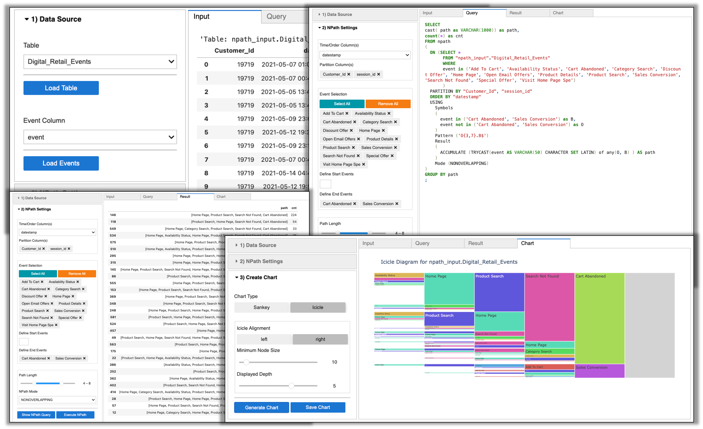

# NPath widget

____

**Update:** npath_widget is now part of the `tdnpathviz` library. I recommend installing it via `pip install tdnpathviz>=0.1.3.1` and use it from there. See the [PyPi Page](https://pypi.org/project/tdnpathviz/)

```python
from tdnpathviz import npath_widget

# Assume 'mydb' is your Database with tables or views with event data
npath_widget(database="mydb")
```

______

See [demo notebook](Npath_widget.ipynb) for a demo. You can run it on [ClearScape Analytics Experience](https://clearscape.teradata.com/).



